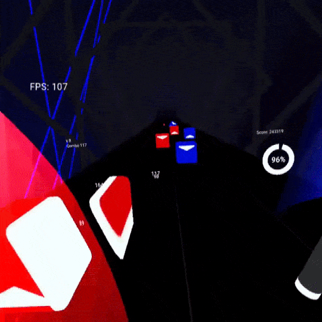
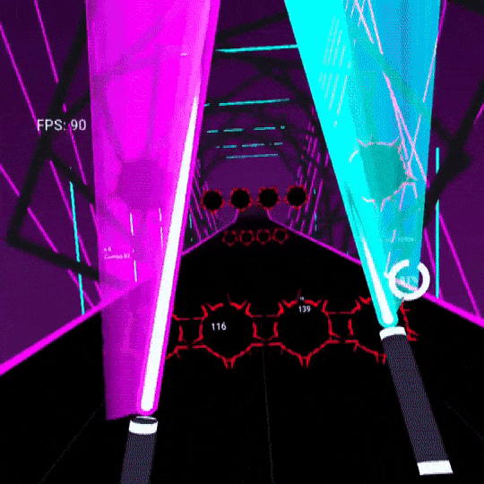
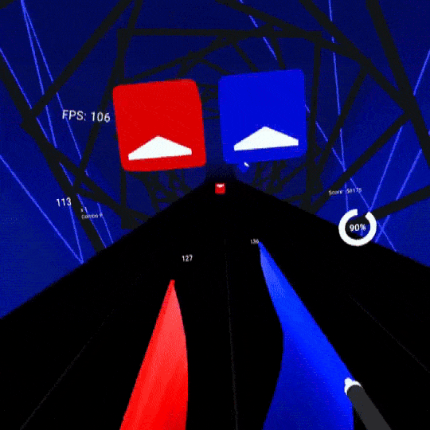

# Open Saber VR
This is a fork of [Beep Saber by NeoSpark314](https://github.com/NeoSpark314/BeepSaber) ported to Godot 4.7 and OpenXR (WIP)
(The OQ Toolkit is only partially ported/patched for it to work on Godot 4 with OpenXR, most features that are not used in this project will not work)

This fork tries to improve the experience and make it more of it's own game instead of just a demo.


This is a basic implementation of the beat saber game mechanic for VR using the [Godot Game Engine](https://godotengine.org/) and the [Godot Oculus Quest Toolkit](https://github.com/NeoSpark314/godot_oculus_quest_toolkit). The main objective of this project is to show how a VR game can be implemented using
the Godot game engine.

The main target platform is the Oculus Quest but it should also work with SteamVR if you add the OpenVR plugin to the addons folder in the godot project.

Originally this game was (and still is) a demo game as part of the Godot Oculus Quest Toolkit. To keep the demo implementation small
this stand alone version was forked so that it can be changed and developed independent of the original demo.




# About the implementation
This game uses Godot 4.7. The implementation supports to load and play maps from [BeatSaver](https://beatsaver.com/).
To export for android headsets the godot openxr vendors plugin may be needed

There is one demo song included that is part of the deployed package.

You can play custom songs by downloading them in the in-game menu. 


# Map format support (ChroMapper compatible)
Maps saved or exported by [ChroMapper](https://github.com/Caeden117/ChroMapper) load directly:

| Format | Info.dat | Difficulty | Status |
|---|---|---|---|
| v2 | `_version` 2.x | `_notes/_obstacles/_events` | supported |
| v3 | `_version` 2.1 | `version` 3.x (`colorNotes`, `sliders`, `burstSliders`, `lightColorEventBoxGroups`, ...) | supported |
| v4 | `version` 4.0.x | `4.1.0` beatmap + `4.0.0` lightshow (index-referenced `*Data` arrays) | supported (converted to v3 internally; rotation event boxes TODO) |

Per-object `customData` (v2 `_`-prefixed and v3 unprefixed keys) is honoured for Chroma `color`, Noodle Extensions `coordinates`, `worldRotation` (Y), `localRotation`, `noteJumpMovementSpeed`, `noteJumpStartBeatOffset`, `uninteractable`/fake objects and obstacle `size`; `track`/`animation`/gravity/look flags are ignored safely. Mapping Extensions 1000-based positions/rotations/sizes are supported. Requirements/suggestions from Info.dat set the mod flags automatically.
See `doc/chromapper_format_spec.md` for the exact keys ChroMapper writes.

# Look and feel (Beat Saber parity)
Gameplay objects and the default environment are rebuilt from measurements of the original game:

* **Movement** (`game/scripts/NoteMovementData.gd`): notes, bombs, chains, arcs and walls follow Beat Saber's
  `NoteMovement`/`FloorMovement`/`ObstacleMovement` model. Objects travel at the map's note jump speed,
  spawn `0.5 s + half jump duration` ahead (`4` beats halved until the half jump distance is under `18 m`, plus the
  map's start beat offset), rise along the gravity arc from their line layer to the cut heights `0.85/1.4/1.9 m`,
  wobble into their cut rotation during the first half of the jump and turn to face the player. Positions are
  evaluated from a smoothed song clock instead of per-frame velocity, so they never drift from the audio.
* **Notes/bombs/walls/sabers**: generated meshes (`game/assets/beatsaber/meshes`) with shaders that mimic the
  `NoteHD`, `BombMaterial`, `ObstacleCore/Frame`, `SaberBlade` and `SaberTrail` materials (colors, rim dimming, cut
  edge glow, 0.4 s trail with a white section, 1 m blade).
* **Environment** (`game/event_driver.tscn`, generated from the "The First" scene: rings, pillars, buildings,
  neon tubes with their light IDs, rotating lasers, runway and platform; `game/environments/TrackLaneRings.gd`
  reproduces the ring spin/zoom effects). HUD panels sit where Beat Saber puts them (combo left, score right,
  energy bar on the runway start).
* Default colors are Beat Saber's "The First" scheme. Chain links use the original slice mesh, note cuts spawn the
  original's sparkle/explosion bursts, bombs explode, and the environment's directional lights follow the light
  events with the original per-light weights.
* Menus use a Beat Saber style theme (`game/ui/beat_saber_theme.tres`: Teko font converted from the game's SDF
  atlases, dark rounded panels, cyan highlights, cyan Play button), the Solo / Online / Campaign / Party tiles,
  the level list rows (cover, song, author, BPM) with the cover / characteristic / difficulty / details column on
  the right, and the pause and "LEVEL CLEARED" results panels in the original layouts. The HUD has the combo panel
  with its combo lines on the left and the score panel with the multiplier circle, immediate rank and song progress
  bar on the right; all 3D text (HUD, cut scores, results, 3D buttons) is Label3D in the same Teko font.
  Set `OPENSABER_SCREENSHOT=<png path>` in the environment to save a menu screenshot and quit;
  `OPENSABER_MENU_SCREEN=levels|pause|results` picks the screen.

Visual smoke test (renders notes, bomb, wall and swinging sabers to a PNG; add `PREVIEW_ENV=1` in the environment
to include the stage, `PREVIEW_ENV=only` for the stage alone):
```
Godot --path . --xr-mode off --resolution 1280x720 tests/visual/VisualPreview.tscn -- --out=/tmp/preview.png
```

# Tests and local playtesting
Unit tests (headless):
```
/Applications/Godot4.7.app/Contents/MacOS/Godot --headless --xr-mode off --path . -s tests/run.gd
```
(`--xr-mode off` keeps an installed OpenXR runtime from holding the headless process open at exit.)
Automated desktop playtest with emulated controllers (no headset needed): plays a map, cuts the notes, records FPS/draw calls/score/lighting per second, saves screenshots and `report.json`:
```
/Applications/Godot4.7.app/Contents/MacOS/Godot --path . --xr-mode off --resolution 1280x720 tests/autoplay/AutoPlayHarness.tscn -- --song="res://game/data/maps/Songs/48088 (Golden - sammy & Tonkie)/" --diff=ExpertStandard --duration=45 --out=/tmp/autoplay --shot-every=5
```
Add `--nofail=1` to keep the run going when the non-dodging bot stands inside walls, and `--bot=0` to only watch.

Quest build (Godot 4.7, gradle build template from the 4.7 export templates, OpenXR vendors addon 5.1.0):
```
JAVA_HOME=/Library/Java/JavaVirtualMachines/temurin-17.jdk/Contents/Home /Applications/Godot4.7.app/Contents/MacOS/Godot --headless --path . --export-debug "Oculus Quest (DEBUG)" ../BeepSaberBin/OpenSaber.apk
```
Install with `adb install -r ../BeepSaberBin/OpenSaber.apk`.

# Credits
The included Music Track is Time Lapse by TheFatRat (https://www.youtube.com/watch?v=3fxq7kqyWO8)

# Licensing
The source code of the godot beep saber / open saber game in this repository is licensed under an MIT License.

<h1>Now About the Mods!</h1>
Currently there is an issue where if there are too many notes, there will be lots of lag.
I have made a fix for this, but I need to bring it over to this repo as its hevily out of date.
<h2>Progress</h2>
<h3>Chroma</h3>
There is full Chroma support*
The only thing you can't do, is control each light with the "_light_id" as it is used in changing environments and Open saber only has 1, but the notes change colour properly!
<h3>Mapping extensions</h3>
Mapping extensions is currently in the works as the walls are placed in a weird way I can't understand, however wall sizeing is fully working along side everything else*
the only things not implemented is archs and chains, as i've never even seen a mapping extension level in v3 anyways.

Songs used for texting: Air (67ba), Dadadada of the bumblebee (922f)

<h3>Noodle extensions</h3>
While I have code that can make it work, there is no animation support and in general is extremly buggy so It's unimplimented but I want to give it support someday!

<h3>Vivify</h3>
No.
